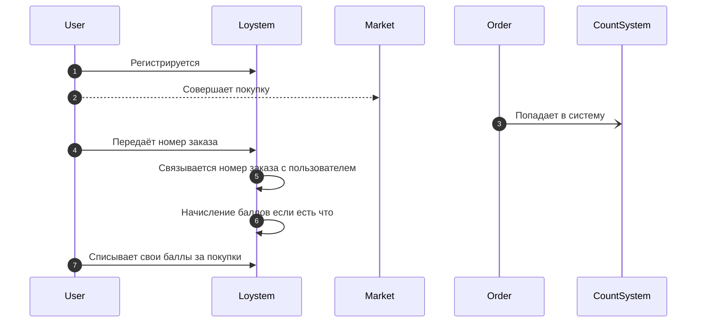
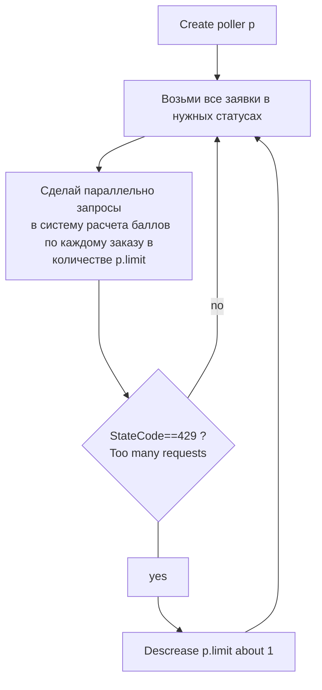

# Loyalty system (loystem)

## Behaviour schema



## Run

```shell
DATABASE_URI='postgresql://localhost/postgres?user=postgres&password=postgres' ACCRUAL_SYSTEM_ADDRESS='http://localhost:8081' RUN_ADDRESS='localhost:8080' ./cmd/gophermart 

```

## Links

### Graceful shutdown

* <https://github.com/gofiber/fiber/issues/899>
* <https://habr.com/ru/articles/771626/>
* <https://followtheprocess.github.io/posts/graceful_shutdown/>
* <https://www.sobyte.net/post/2021-10/go-http-server-shudown-done-right/>

## Orders Info Poller



## TODOs

* FindAll orders rename
* to read
  * time.Tick(p.interval)
  * time.After(p.interval)
